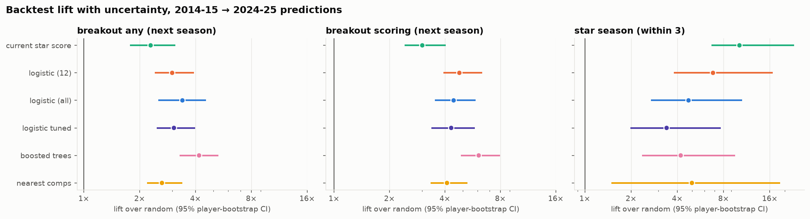
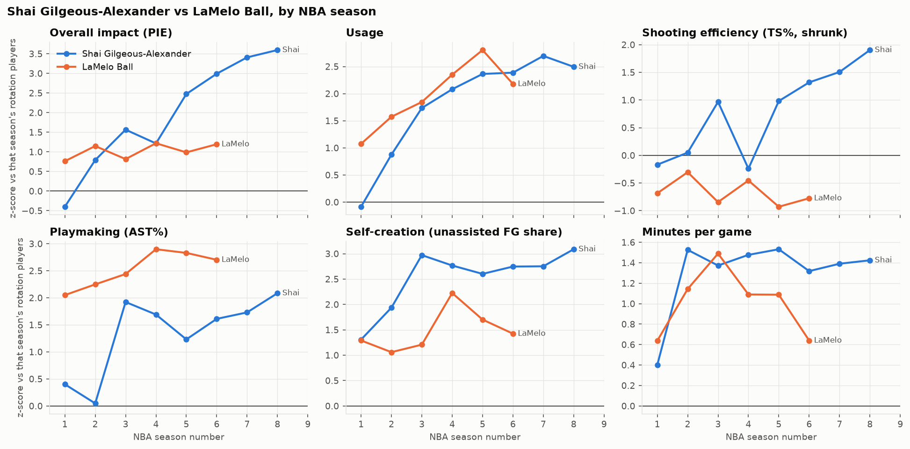
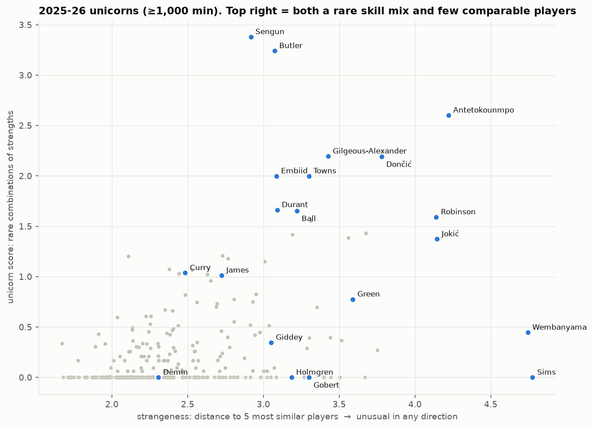
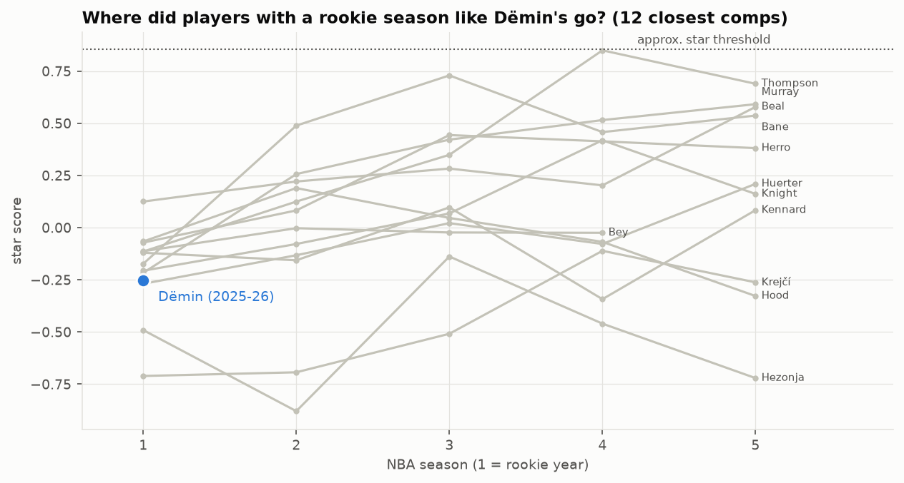

# NBA Unicorn & Breakout Hunting

**Could we have spotted future NBA breakouts, stars and "unicorns" *before* they became obvious, using only what was known at the time?**

This project treats player scouting like backtesting an investment strategy. For every season from 2011-12 to 2024-25 it rebuilds what was knowable at the end of that season, ranks young players by their chance of breaking out, and scores those rankings against what actually happened. Only then does it apply the method to current players, including a case study of **Egor Dëmin** (rookie, 2025-26).

## Key findings

**1. Breakouts are partly predictable, honestly.** In a strict walk-forward backtest (2014-15 → 2024-25 predictions, players aged ≤ 25):

| Outcome (next season unless noted) | Base rate | Best model | Lift over random (95% CI) | Top-10 hit rate |
|---|---|---|---|---|
| Any breakout | 6.9% | Boosted trees | **4.2×** (3.3–5.3) | 39% |
| Scoring breakout | 4.9% | Boosted trees | **6.1×** (4.9–8.0) | — |
| Star season within 3 years | 1.6% | Current star score (no model beat it) | **10×** (6.7–23) | 16% |

**2. Simple is nearly as good as complex.** A 12-signal logistic regression reaches about 90% of the 197-feature model's performance. What signals a breakout: already earning minutes, rising usage and minutes, self-creation, efficiency and passing. Against: age, a late draft slot, and already having high usage.

**3. For stardom, current all-round quality beats everything.** With only ~26 future stars to learn from, extra features overfit. Being good *relative to peers* early is the most reliable signal.

**4. There are two routes to stardom.** Some stars *break out* (Shai, Giannis, Jokić, Tatum); others *climb steadily* without a single breakout season (Anthony Edwards, Booker, Mitchell, Kawhi). Steady risers are visible early from current quality alone (8.6× random); breakout-route stars need trajectory signals (4.6–5.6×).

**4b. The model learns from trajectories, not single seasons.** Shai Gilgeous-Alexander was ranked 37th of 229 young players after his rookie year (not flagged), then **12th after year 2**, once his usage, minutes and self-creation trajectory appeared.

**5. Unicorns come in two kinds.** *Combination unicorns* have rare mixes of strengths (Giannis, Jokić, Durant, LeBron, Porziņģis). *Extreme unicorns* have no comparable players at all; Wembanyama is the most extreme player in the dataset.

**6. Egor Dëmin (after one season):** 5.3% breakout chance for 2026-27 (about typical). His rookie profile most resembles Huerter, Herro, Kennard, Jamal Murray, Klay Thompson and Bane: rookie shooters who broke out more often than average (28% vs 21% within 3 years) but rarely became stars. His size and passing set him apart from that group. Year 2 will be far more informative.

**Data findings along the way:**
- The NBA's 2019 switch to measured heights made 56% of players shorter overnight.
- NBA.com's `PlayerIndex` returns *current* bio values for past seasons, which is a leakage trap.
- The bio endpoint attaches the wrong draft records to some players.
- PIE over-represents big men among "stars" by about 2×.
- The league has become measurably more positionless since 2012.

## Selected figures

| | |
|---|---|
|  |  |
| Walk-forward lift over random, with player-bootstrap CIs | Shai vs LaMelo by NBA season (season-relative z-scores) |
|  |  |
| 2025-26: rare skill combinations vs no comparable players | Where players with a rookie season like Dëmin's went |

All figures are in [`outputs/figures/`](outputs/figures/); every notebook is saved with its outputs.

## How it works

| Notebook | What it does |
|---|---|
| `00_setup` | Environment check; anatomy of `PlayerCareerStats` |
| `01_data_exploration` | Which `nba_api` endpoints are league-wide and time-correct (and which leak) |
| `02_player_seasons` | 733 cached API responses → clean player-season table; redundancy analysis; beta-binomial shrinkage of shooting %; season-relative z-scores/percentiles |
| `03_player_trajectories` | Rolling level, trend, change and "vs own past" for every feature, **leakage-tested** (identical when later seasons are deleted); normal development by age |
| `04_unicorn_hunting` | Listed / body / style position spectrum; combination-rarity and nearest-neighbour strangeness scores |
| `05_breakout_hunting` | Objective breakout labels (production, role, scoring) relative to each player's own past; our own six-pillar star metric with a size-fairness dial |
| `06_breakout_backtest` | Walk-forward backtest: rules, logistic, boosted trees, nearest comps; bootstrap CIs, calibration, minutes-threshold sensitivity |
| `07_current_players` | 2026-27 breakout outlook; Dëmin profile and historical comps |
| `08_breakout_board` | Every season's top-10 breakout picks vs what happened: poster (`outputs/figures/08_breakout_board.png`) and interactive page (`outputs/breakout_board.html`) |
| `09_routes_to_stardom` | Breakout route vs steady route into the star tier (top 10%); which is more predictable; live outlook |

**Anti-leakage rules used throughout:**
- Features for season *t* use seasons ≤ *t* only.
- A training example is used only once its outcome was known at prediction time (*s* + horizon ≤ *t*).
- Preprocessing is fitted inside each fold.
- The "normal improvement" age curve is frozen on 2011-16.
- Award data (Most Improved Player) is used for validation only.

## Reproduce

```bash
git clone <this repo> && cd <repo>
python -m venv .venv && source .venv/bin/activate
pip install -r requirements.txt
pip install -e .                 # makes `import unicorn` (src/unicorn) available
python -m unicorn.download       # ~733 cached NBA.com requests (~40 min first time; resumable)
```

Then run the notebooks in order (`00` → `07`). Each one writes the processed table the next one reads (`data/processed/*.parquet`). Raw responses are cached in `data/raw/` as untouched gzipped JSON, so re-runs make no API calls.

## Project structure

```
notebooks/          numbered research pipeline (00 → 07)
src/unicorn/        reusable code
  raw.py            cached nba_api access (raw JSON, retries)
  download.py       full 2011-12 → 2025-26 download list
  player_season.py  clean player-season tables
  columns.py        data dictionary (role of every column)
  features.py       shrinkage + season-relative scaling
  trajectories.py   leakage-safe rolling/trend/vs-past features
  position.py       listed / body / style position spectrum
  unicorn.py        combination-rarity and strangeness scores
  labels.py         breakout labels, star metric, future windows
  backtest.py       walk-forward engine, models, metrics, bootstrap
  comps.py          historical nearest-neighbour comparables
  board.py          breakout board data + interactive HTML page
  stats.py, plotting.py
data/raw/, data/processed/   (git-ignored, regenerated from code)
outputs/figures/, outputs/tables/
```

## Limitations
- **Box-score and tracking-free data only** (NBA.com). No play-by-play, lineups, injuries, contracts or scouting information. On-court net rating mixes player and team quality.
- **Small numbers of positives:** about 26 future stars and 28 production breakouts in the backtest window, so those results have wide intervals.
- **"Star" is our own definition** (six equally weighted pillars). One-dimensional scorers (e.g. Booker) rarely qualify, by design.
- **One rookie season is thin evidence.** Predictions for second-year players are much better informed than for rookies.
- Rows begin in 2011-12, so career-to-date counts for veterans who debuted earlier are truncated (experience uses the official roster value).

## Methodological decisions
| # | Decision | Rationale / caveat |
|---|---|---|
| D1 | Unit of analysis = one consolidated row per player-season (`LeagueDashPlayerStats`); `TEAM_COUNT` kept as a traded flag | Player development is the object of study. Team context for traded players needs per-team splits, which we'll add only if needed. |
| D2 | Request totals and derive rates ourselves; take possession-based rates (USG%, AST%, …) from NBA.com | Totals add up across seasons and stints, which rolling windows and shrinkage need. |
| D3 | Height/weight = **as listed each season** (`LeagueDashPlayerBioStats`) | Time-correct. Caveat: the NBA switched to measured heights in 2019-20 (56% of players got shorter, mean −0.57 in), so there is a level shift at that season. |
| D4 | Listed position = **as listed each season** (`CommonTeamRoster`), never `PlayerIndex` | `PlayerIndex` returns current values for any season, which leaks future information. Roster position is missing for about 9% of player-seasons (about 1.4% of minutes). |
| D5 | Also build a **derived continuous position spectrum** from same-season stats; evaluate against listed position | Listed labels are coarse (G/F/C + hybrids). Where derived and listed position disagree may itself be a "unicorn" signal. |
| D6 | Age = exact age on **Feb 1** of the season (from roster birth date); NBA integer age as fallback (`age_source`) | Mid-season convention. Birth date is a fixed fact, so it can come from any season's roster without leakage. |
| D7 | **No rows dropped** for low minutes; reliability columns (`min`, `poss`, `fga`, `fta`, `fg3a`) kept | Minimum-minute thresholds are a modelling choice. They will be toggleable and their effect examined. |
| D8 | Playoffs in a **separate table** (`player_season_playoffs`), same key | Not every player has playoff data, and keeping it apart prevents accidental leakage. Planned use: does *early* playoff experience predict development? |
| D9 | Draft info from `DraftHistory` (by player ID), not the bio endpoint | The bio endpoint carries wrong draft records for some players (e.g. Walker Russell Jr. has his father's 1982 pick). |
| D10 | **When undecided, keep the feature**; redundancy is flagged, not deleted | Overfitting can be pruned later; information dropped too early cannot be recovered. Final selection happens inside each walk-forward window. |
| D11 | Shooting percentages shrunk with a **beta-binomial prior per season × listed-position group** (`*_shr`) | Validated on the first training window: 29–53% lower next-season error than raw. |
| D12 | **Season-relative** z-score and percentile for every feature, scaled on that season's ≥500-min players (`*_z`, `*_pctl`); raw kept | League 3PA rate rose from 0.22 to 0.42 and mid-range rate fell from 0.29 to 0.09 over 2011-26. |
| D13 | Season-to-season change is measured against the **previous season played**, with `seasons_missed` recording gaps | Keeps injury comebacks (e.g. Klay Thompson 2018-19 → 2021-22) instead of blanking them; the gap itself is informative. |
| D14 | Trajectories: 3-season rolling **level** and **trend** (shooting % weighted by attempts, other stats by minutes) plus **vs-own-past** deviation; outlier seasons kept as they happened | Level, direction and "unusual for him" are different signals. No player-history shrinkage: the actual season is kept and flagged. |
| D15 | Position spectrum on one 1 (G) → 5 (C) scale: **listed**, **body** (height/weight) and **style** (stats only); ridge models fitted on seasons ≤ *t* | Gaps between body and style are a direct unicorn signal (e.g. LeBron, Jokić). Out-of-sample R² vs listed position: style 0.68–0.79, body 0.76–0.83, both declining as the league becomes positionless. |
| D16 | Two unicorn scores, each relative to that season only: **combination** (summed excess rarity of trait pairs a player is top-20% in) and **strangeness** (mean distance to his 5 most similar rotation players) | Rejected after testing: "rarest single pair" (saturates; rewards being #1 at one skill) and robust Mahalanobis distance (treats the whole cluster of traditional centres as outliers). Headline lists require ≥ median impact; raw scores kept. |
| D17 | **Own star metric**: six equally weighted pillars (scoring, creation, rebounding, defense, impact, trust) from that season only, half-adjusted for body size (dial 0.5); star season = top 5% (≥ 1,500 scaled min). Breakout labels: production, role, scoring and any, predicted one season ahead; star predicted within 3 seasons | PIE over-represents bigs (27% of PIE stars vs 14% of players) and media awards carry their own biases. At dial 0.5 bigs are 18% and guards 33% of star seasons. |
| D18 | **Walk-forward backtest**: test season *t* uses features ≤ *t*; a training row from season *s* is used only if its outcome was known by *t* (*s* + horizon ≤ *t*); preprocessing fitted per fold. Population: all players aged ≤ 25 (stars excluded for the star outcome). Metrics: average precision and lift, top-*k* hit rate | Breakouts are rare (1–7%), so accuracy is meaningless. First results: any breakout 3.4×, scoring 4.8×, star-within-3 10× (current star score). |
| D19 | Production models: **boosted trees** for breakout probabilities (best lift and calibration); **current star score** for star potential; **nearest comps** for explanation only | Backtest with player-bootstrap CIs: trees 4.2× any / 6.1× scoring; star score 10× for star-within-3, beating every trained model; inner-window tuning did not help. |
| D20 | **No minimum-minutes filter** on the prediction population | Cut-offs leave the top-10 hit rate unchanged (36–40%) but drop up to 17% of future breakouts and 19% of future stars. Breakout-season minutes (900/1,200/1,500) don't change conclusions. |
| D21 | **Two routes to the star tier** (top 10% by star score, within 3 seasons): *breakout route* (≥ 1 breakout season on the way) vs *steady route* (no breakout season, ≥ 10 percentile-point climb from the latest known level). Repeated breakouts are kept as-is | Captures stars like Anthony Edwards who never 'break out' but climb consistently. Hard breakout thresholds kept for now (e.g. Anthony Black at 14.98 ppg just misses the 15-ppg scoring bar). |

## Backlog (revisit later)
- **External advanced metrics**: Basketball-Reference BPM / OBPM / DBPM / VORP / Win Shares / PER, and CraftedNBA metrics. Popular with analysts; would add impact measures that NBA.com lacks. Check each site's terms and rate limits before scraping. Use as features (lagged) and as alternative outcome definitions.
- **Interactive star dashboard**: sliders for the six star-pillar weights and the size-fairness dial (`unicorn.labels.STAR_PILLARS`, `SIZE_ADJUSTMENT`), showing live who qualifies as a star by season. Current choice (D17): equal pillar weights, dial 0.5. One-dimensional scorers (Booker, Edwards, Brunson) rarely qualify under these settings, which is intended for now.
